# DESKRIPSI PERANCANGAN PERANGKAT LUNAK

## ServiceRide

| Informasi | Keterangan |
|---|---|
| Nama Sistem | ServiceRide |
| Jenis Dokumen | Deskripsi Perancangan Perangkat Lunak |
| Singkatan | DPPL |
| Acuan | SKPL ServiceRide v1.0 |
| Versi | 1.0 |
| Status | Draft |

# 1. Pendahuluan

Dokumen Deskripsi Perancangan Perangkat Lunak atau DPPL ServiceRide menjelaskan rancangan teknis yang digunakan untuk merealisasikan kebutuhan yang telah didefinisikan pada SKPL ServiceRide.

ServiceRide merupakan sistem yang menghubungkan customer dengan bengkel untuk proses booking servis, troubleshooting awal, estimasi biaya, pickup dan delivery kendaraan, pemeriksaan kendaraan, monitoring servis, serta pembayaran.

Rancangan pada dokumen ini mencakup:

1. Arsitektur sistem.
2. Perancangan frontend.
3. Perancangan backend.
4. Perancangan database.
5. Entity Relationship Diagram.
6. Struktur komponen.
7. Perancangan API.
8. Sequence Diagram.
9. Activity Diagram.
10. Perancangan antarmuka.
11. Integrasi layanan eksternal.
12. Keamanan dan konsistensi data.
13. Struktur deployment.
14. Traceability terhadap SKPL.

Stack teknologi yang sudah ditetapkan pada project adalah frontend menggunakan React, Vite, TypeScript, Tailwind CSS, dan shadcn/ui. Backend menggunakan Golang dengan PostgreSQL, pgvector, Redis, dan sqlc.

Struktur database, endpoint API, pembagian module backend, dan penggunaan pgvector pada dokumen ini merupakan rancangan awal dan masih dapat direvisi ketika implementasi dimulai.

# 2. Prinsip Perancangan

ServiceRide dirancang menggunakan beberapa prinsip utama.

1. PostgreSQL menjadi sumber data utama atau source of truth.

2. Redis tidak digunakan sebagai penyimpanan permanen. Redis hanya digunakan untuk cache, rate limiting, temporary state, dan kebutuhan koordinasi yang tidak boleh menggantikan data PostgreSQL.

3. Frontend tidak melakukan akses langsung ke database.

4. Seluruh perubahan data bisnis dilakukan melalui backend.

5. Setiap fitur memiliki batas tanggung jawab yang jelas.

6. Perubahan status booking harus mengikuti alur status yang valid.

7. Penambahan biaya servis tidak boleh langsung dianggap disetujui customer.

8. Pembayaran harus dapat diverifikasi berdasarkan transaksi dari Payment Provider.

9. Pickup dan delivery harus memiliki informasi driver serta pencatatan serah terima kendaraan.

10. Aktivitas penting harus memiliki riwayat agar dapat ditelusuri.

Prinsip tersebut juga mempertimbangkan risiko proyek yang telah diidentifikasi, khususnya keamanan kendaraan saat pickup, perubahan estimasi biaya, keterlambatan pelayanan, dan ketergantungan terhadap third party.

# 3. Arsitektur Sistem

ServiceRide menggunakan arsitektur client server dengan backend sebagai pusat business logic.

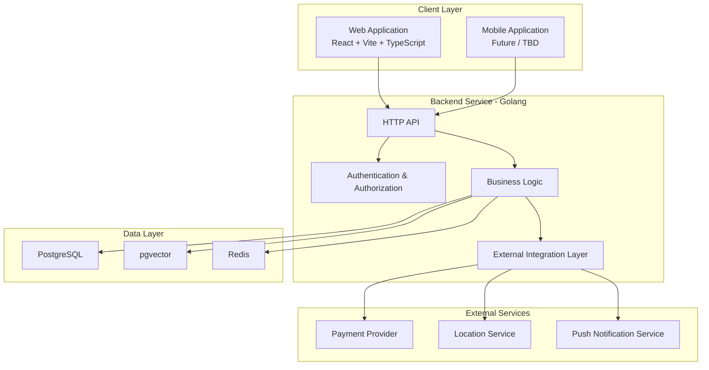

Frontend bertanggung jawab pada presentation layer dan interaksi pengguna.

Backend bertanggung jawab atas:

1. Validasi request.
2. Authorization.
3. Business rules.
4. Pengelolaan booking.
5. Pemeriksaan kendaraan.
6. Pengelolaan estimasi dan persetujuan biaya.
7. Pickup dan delivery.
8. Pembayaran.
9. Notifikasi.
10. Integrasi third party.
11. Penyimpanan data.

PostgreSQL menjadi penyimpanan utama, sedangkan Redis menjadi komponen pendukung.

# 4. Perancangan Frontend

Frontend ServiceRide menggunakan pendekatan feature based agar masing masing domain dapat dikembangkan secara terpisah.

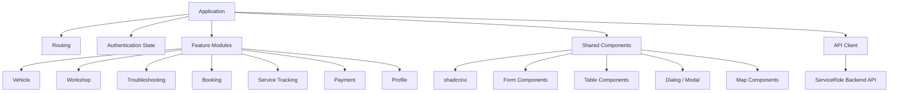

Struktur frontend yang disarankan:

```text
src/
  app/
  components/
  features/
    auth/
    vehicles/
    workshops/
    troubleshooting/
    bookings/
    service/
    transport/
    payments/
    notifications/
  lib/
  services/
  types/
  hooks/
```

Business rules tidak ditempatkan pada komponen UI.

Frontend hanya bertanggung jawab terhadap:

1. Menampilkan data.
2. Mengambil input pengguna.
3. Validasi dasar input.
4. Mengirim request.
5. Menampilkan response dan error.

Validasi final tetap dilakukan oleh backend.

# 5. Perancangan Backend

Backend dirancang menggunakan modular layered architecture.

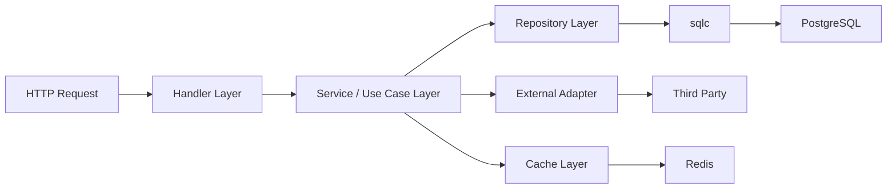

Pembagian tanggung jawab:

| Layer | Tanggung Jawab |
|---|---|
| Handler | Menerima HTTP request, parsing input, dan menghasilkan HTTP response |
| Service / Use Case | Menjalankan business logic dan aturan bisnis |
| Repository | Interface akses data |
| sqlc | Menjalankan query PostgreSQL dengan generated code |
| Adapter | Menghubungkan backend dengan layanan pihak ketiga |
| Cache | Mengelola data sementara pada Redis |

Module utama backend dirancang sebagai:

1. Auth.
2. User.
3. Vehicle.
4. Workshop.
5. Service Catalog.
6. Troubleshooting.
7. Booking.
8. Inspection.
9. Quotation.
10. Service Job.
11. Transport.
12. Billing.
13. Payment.
14. Notification.
15. Support.

# 6. Perancangan Database

Database utama menggunakan PostgreSQL.

Primary key disarankan menggunakan UUID agar identifier tidak bergantung pada sequence yang mudah ditebak dan lebih aman digunakan pada distributed environment.

Penggunaan UUID merupakan keputusan desain awal dan masih dapat direvisi sebelum database migration dibuat.

## 6.1 Identity dan Workshop

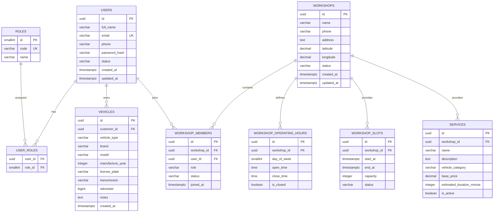

`WORKSHOP_MEMBERS` digunakan untuk menentukan hubungan user dengan bengkel.

Contohnya satu user dapat menjadi:

1. Owner pada bengkel A.
2. Admin pada bengkel A.
3. Mechanic pada bengkel B.

Dengan demikian role operasional bengkel tidak disimpan langsung sebagai satu kolom pada `USERS`.

# 7. ERD Booking dan Servis

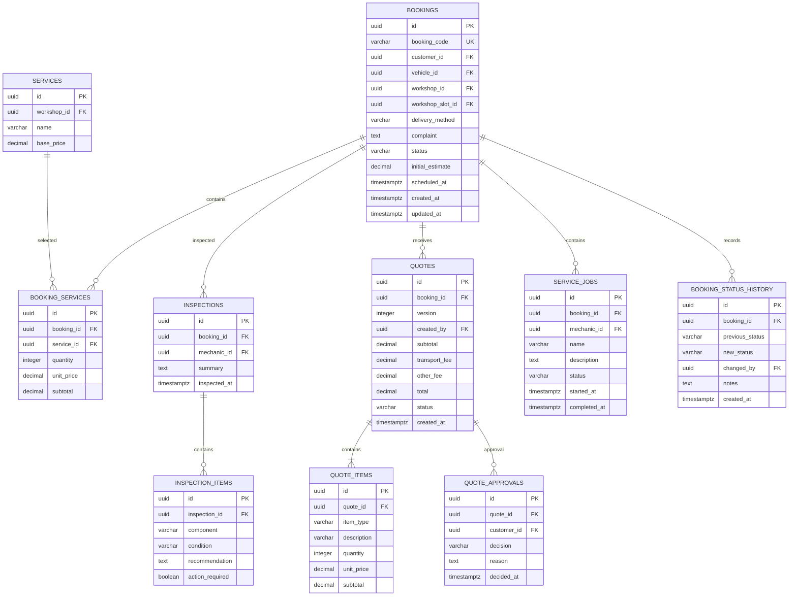

Pemisahan `QUOTES` dan `QUOTE_ITEMS` diperlukan karena satu booking dapat memperoleh lebih dari satu versi estimasi.

Contoh:

1. Quote versi 1 dibuat berdasarkan booking awal.
2. Kendaraan diperiksa.
3. Mekanik menemukan kampas rem harus diganti.
4. Quote versi 2 dibuat.
5. Customer menerima quote versi 2.
6. Quote versi 2 menjadi dasar pekerjaan tambahan.

Quote lama tetap disimpan untuk kebutuhan audit.

# 8. ERD Pickup, Delivery, dan Pembayaran

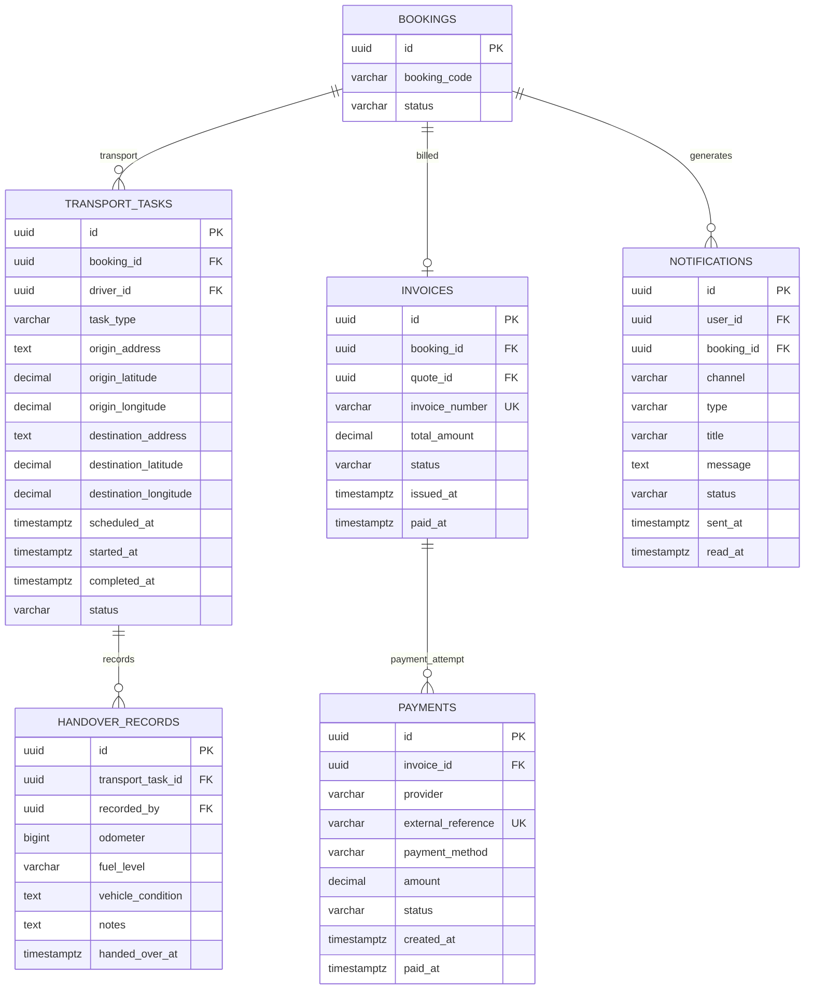

Satu booking dapat mempunyai dua `TRANSPORT_TASKS`.

Contoh:

1. `PICKUP`: customer menuju bengkel.
2. `DELIVERY`: bengkel menuju customer.

Keduanya tidak digabung menjadi satu record karena driver, waktu, rute, dan status keduanya dapat berbeda.

# 9. ERD Troubleshooting

PostgreSQL pada project telah direncanakan menggunakan pgvector.

Rancangan awal penggunaan pgvector adalah membantu pencarian pengetahuan troubleshooting berdasarkan kemiripan gejala.

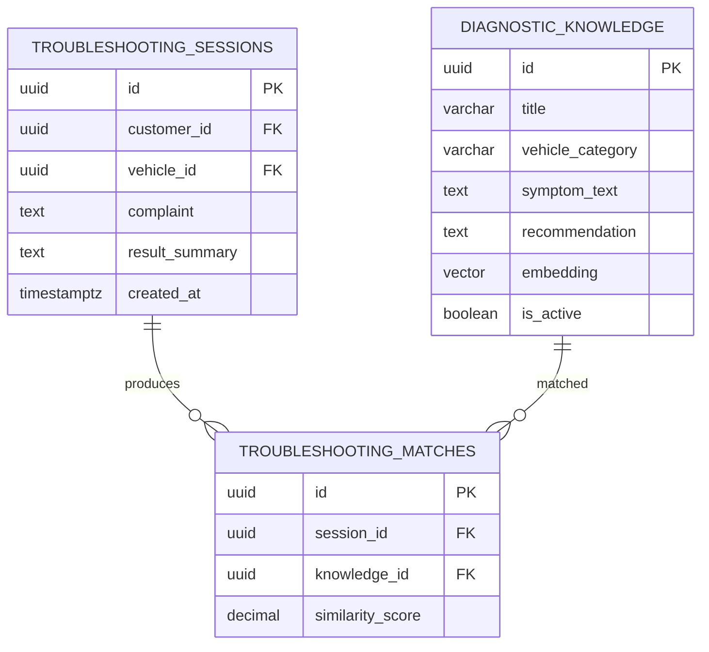

Hasil troubleshooting tetap hanya bersifat informasi awal sebagaimana ditentukan pada SKPL.

Hasil tersebut tidak boleh menggantikan diagnosis dari mekanik.

# 10. Relasi dan Constraint Krusial

Beberapa constraint perlu diterapkan sejak database dan service layer dibuat.

1. Kendaraan pada booking harus dimiliki customer yang membuat booking.

2. Service yang dipilih harus berasal dari workshop yang sama dengan booking.

3. Workshop slot harus berasal dari workshop yang sama dengan booking.

4. Jumlah booking aktif tidak boleh melebihi kapasitas slot.

5. Mechanic yang menerima pekerjaan harus merupakan member aktif pada workshop tersebut.

6. Driver yang menerima transport task harus merupakan member aktif pada workshop tersebut.

7. Customer hanya dapat memberikan approval terhadap quote dari booking miliknya.

8. Quote yang telah digantikan versi baru tidak boleh menjadi dasar invoice kecuali kembali diaktifkan melalui proses yang sah.

9. Pekerjaan tambahan yang menambah biaya hanya dapat dilakukan setelah quote mendapatkan approval customer.

10. Invoice hanya dibuat berdasarkan quote final yang telah disetujui.

11. Nilai payment harus mengacu pada invoice.

12. `external_reference` pada payment harus unique untuk mencegah transaksi yang sama diproses lebih dari satu kali.

13. Payment callback atau webhook harus diproses secara idempotent.

14. Perubahan status booking harus disimpan pada `BOOKING_STATUS_HISTORY`.

15. Redis tidak boleh menjadi satu satunya tempat penyimpanan status booking, payment, atau servis.

# 11. Struktur Komponen Backend

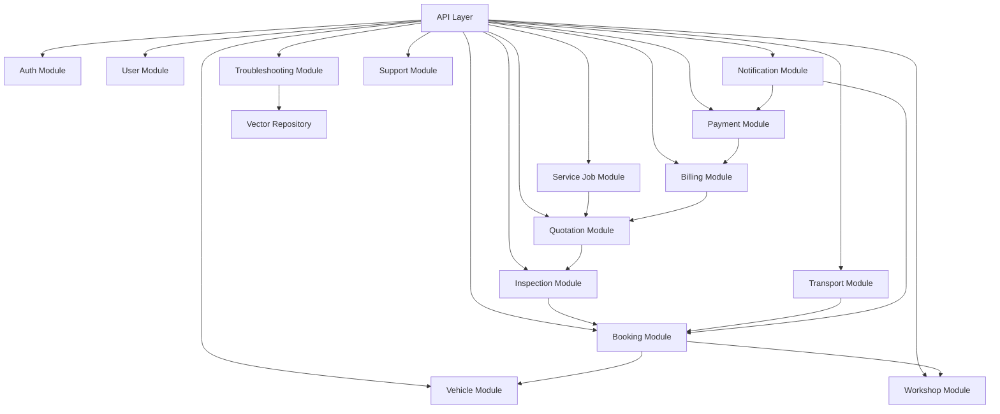

Dependensi antar module dibuat satu arah untuk mengurangi coupling.

Contohnya `Payment Module` tidak mengubah booking secara langsung melalui database.

Alur yang disarankan:

`Payment → Billing Service → Booking Service`

Dengan pendekatan tersebut business rule perubahan booking tetap berada pada Booking Service.

# 12. Perancangan API

API berikut merupakan rancangan awal REST API.

## 12.1 Authentication dan User

| Method | Endpoint | Fungsi |
|---|---|---|
| POST | `/api/v1/auth/register` | Registrasi akun |
| POST | `/api/v1/auth/login` | Login |
| POST | `/api/v1/auth/logout` | Logout |
| GET | `/api/v1/me` | Mendapatkan profil pengguna |
| PATCH | `/api/v1/me` | Memperbarui profil |

Mekanisme session atau access token belum ditetapkan pada sumber project dan harus diputuskan sebelum implementasi authentication dimulai.

## 12.2 Vehicle

| Method | Endpoint | Fungsi |
|---|---|---|
| GET | `/api/v1/vehicles` | Daftar kendaraan customer |
| POST | `/api/v1/vehicles` | Menambahkan kendaraan |
| GET | `/api/v1/vehicles/{id}` | Detail kendaraan |
| PATCH | `/api/v1/vehicles/{id}` | Memperbarui kendaraan |
| DELETE | `/api/v1/vehicles/{id}` | Menghapus atau menonaktifkan kendaraan |

## 12.3 Workshop

| Method | Endpoint | Fungsi |
|---|---|---|
| GET | `/api/v1/workshops` | Pencarian bengkel |
| GET | `/api/v1/workshops/{id}` | Detail bengkel |
| GET | `/api/v1/workshops/{id}/services` | Daftar layanan |
| GET | `/api/v1/workshops/{id}/slots` | Jadwal tersedia |
| POST | `/api/v1/workshops/{id}/services` | Menambahkan layanan |
| PATCH | `/api/v1/workshops/{id}` | Memperbarui informasi bengkel |

## 12.4 Troubleshooting

| Method | Endpoint | Fungsi |
|---|---|---|
| POST | `/api/v1/troubleshooting` | Membuat troubleshooting session |
| GET | `/api/v1/troubleshooting/{id}` | Melihat hasil troubleshooting |

## 12.5 Booking

| Method | Endpoint | Fungsi |
|---|---|---|
| GET | `/api/v1/bookings` | Daftar booking pengguna |
| POST | `/api/v1/bookings` | Membuat booking |
| GET | `/api/v1/bookings/{id}` | Detail booking |
| POST | `/api/v1/bookings/{id}/accept` | Bengkel menerima booking |
| POST | `/api/v1/bookings/{id}/cancel` | Membatalkan booking |
| GET | `/api/v1/bookings/{id}/history` | Riwayat perubahan status |

## 12.6 Inspection dan Quotation

| Method | Endpoint | Fungsi |
|---|---|---|
| POST | `/api/v1/bookings/{id}/inspections` | Membuat hasil pemeriksaan |
| GET | `/api/v1/bookings/{id}/inspections` | Melihat pemeriksaan |
| POST | `/api/v1/bookings/{id}/quotes` | Membuat quote |
| GET | `/api/v1/bookings/{id}/quotes` | Daftar quote |
| POST | `/api/v1/quotes/{id}/approve` | Customer menerima quote |
| POST | `/api/v1/quotes/{id}/reject` | Customer menolak quote |

## 12.7 Service Job

| Method | Endpoint | Fungsi |
|---|---|---|
| GET | `/api/v1/mechanic/jobs` | Daftar pekerjaan mekanik |
| GET | `/api/v1/mechanic/jobs/{id}` | Detail pekerjaan |
| POST | `/api/v1/mechanic/jobs/{id}/start` | Memulai servis |
| POST | `/api/v1/mechanic/jobs/{id}/complete` | Menyelesaikan servis |

## 12.8 Transport

| Method | Endpoint | Fungsi |
|---|---|---|
| GET | `/api/v1/driver/tasks` | Daftar pickup atau delivery |
| GET | `/api/v1/driver/tasks/{id}` | Detail tugas |
| POST | `/api/v1/driver/tasks/{id}/start` | Memulai perjalanan |
| POST | `/api/v1/driver/tasks/{id}/handover` | Mencatat serah terima |
| POST | `/api/v1/driver/tasks/{id}/complete` | Menyelesaikan tugas |

## 12.9 Payment

| Method | Endpoint | Fungsi |
|---|---|---|
| GET | `/api/v1/bookings/{id}/invoice` | Mendapatkan invoice |
| POST | `/api/v1/invoices/{id}/payments` | Membuat pembayaran |
| GET | `/api/v1/payments/{id}` | Melihat status pembayaran |
| POST | `/api/v1/webhooks/payment` | Callback Payment Provider |

Endpoint webhook tidak menggunakan authorization pengguna biasa.

Keaslian request harus diverifikasi menggunakan mekanisme signature yang disediakan Payment Provider.

# 13. Sequence Diagram Booking Servis

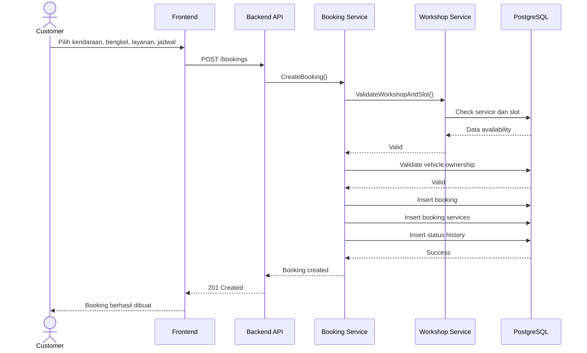

# 14. Sequence Diagram Pemeriksaan dan Persetujuan Biaya

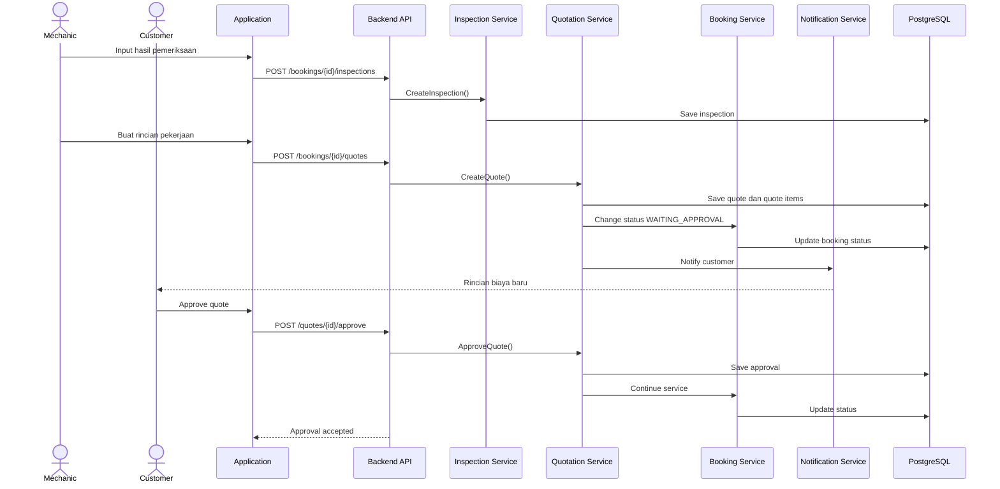

# 15. Sequence Diagram Pickup Kendaraan

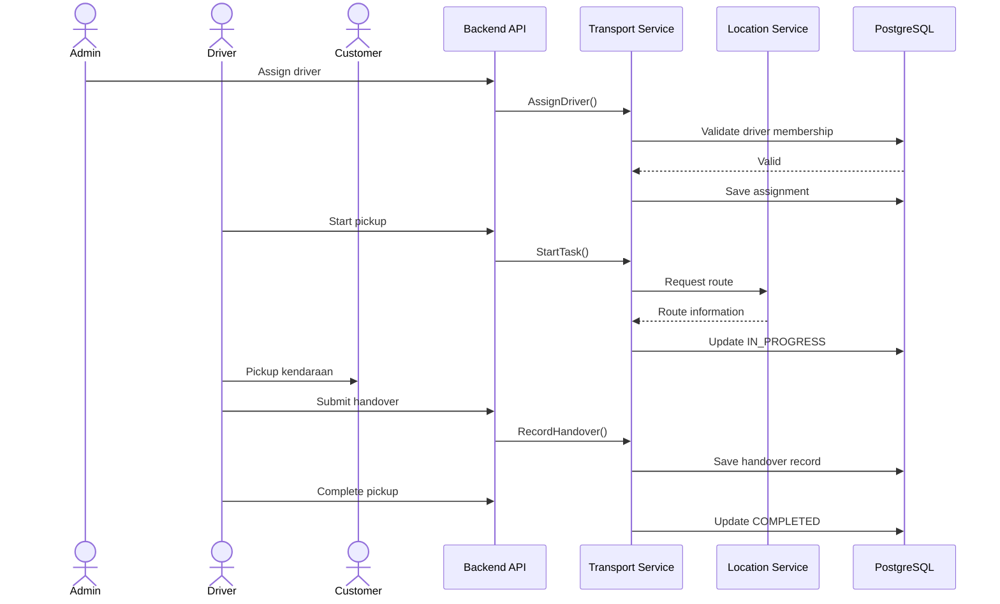

# 16. Sequence Diagram Pembayaran

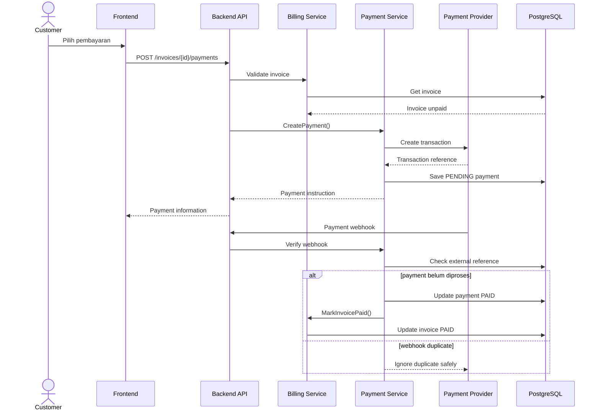

# 17. Activity Diagram Proses Servis

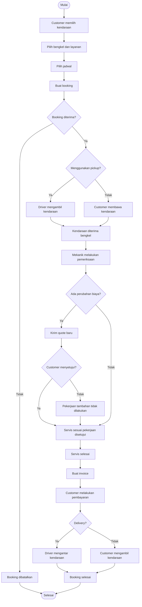

# 18. State Diagram Booking

Perubahan status booking tidak dilakukan secara bebas.

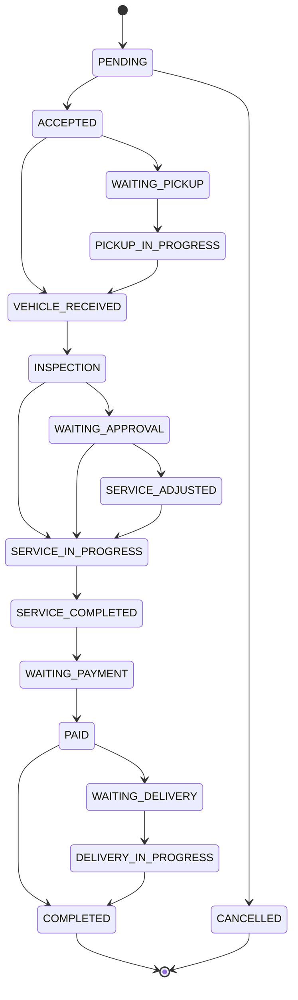

Backend harus menolak perubahan status yang tidak mempunyai transition valid.

Contoh:

`PENDING → SERVICE_COMPLETED`

harus ditolak.

# 19. Perancangan Interface

Perancangan UI pada DPPL difokuskan pada struktur layar dan kebutuhan informasi, bukan desain visual akhir.

## 19.1 Customer

### Dashboard

Menampilkan:

1. Kendaraan milik customer.
2. Booking aktif.
3. Status servis terbaru.
4. Notifikasi.
5. Shortcut pencarian bengkel.

### Daftar Bengkel

Menampilkan:

1. Nama bengkel.
2. Lokasi.
3. Jarak.
4. Jam operasional.
5. Jenis kendaraan yang dilayani.
6. Layanan tersedia.

### Detail Bengkel

Menampilkan:

1. Informasi bengkel.
2. Lokasi.
3. Jam operasional.
4. Daftar layanan.
5. Estimasi harga.
6. Jadwal tersedia.
7. Tombol booking.

### Booking

Form booking terdiri dari:

1. Kendaraan.
2. Bengkel.
3. Layanan.
4. Keluhan.
5. Jadwal.
6. Pickup atau datang langsung.
7. Estimasi biaya awal.

### Detail Booking

Menampilkan:

1. Booking code.
2. Kendaraan.
3. Bengkel.
4. Jadwal.
5. Status.
6. Status history.
7. Mekanik apabila telah ditentukan.
8. Driver apabila menggunakan pickup.
9. Pemeriksaan.
10. Quote.
11. Approval.
12. Invoice.
13. Payment.

## 19.2 Admin Bengkel

Dashboard admin menyediakan:

1. Booking hari ini.
2. Booking menunggu persetujuan.
3. Kendaraan sedang diservis.
4. Pickup aktif.
5. Mekanik tersedia.
6. Driver tersedia.

Admin juga mempunyai halaman:

1. Booking.
2. Jadwal.
3. Service catalog.
4. Mekanik.
5. Driver.
6. Pickup dan delivery.
7. Workshop settings.

## 19.3 Mekanik

Mekanik mempunyai tampilan yang lebih sederhana.

Fungsi utama:

1. Melihat pekerjaan.
2. Membuka detail kendaraan.
3. Melihat keluhan.
4. Menginput pemeriksaan.
5. Menginput pekerjaan tambahan.
6. Memulai servis.
7. Menyelesaikan servis.

## 19.4 Driver

Driver mempunyai halaman:

1. Daftar tugas.
2. Detail pickup.
3. Detail delivery.
4. Navigasi lokasi.
5. Konfirmasi serah terima.
6. Status perjalanan.

# 20. Integrasi Location Service

Location Service digunakan untuk:

1. Mendapatkan koordinat.
2. Menampilkan lokasi bengkel.
3. Menghitung jarak.
4. Membantu rute pickup.
5. Membantu rute delivery.

Backend tidak boleh bergantung langsung pada format response provider.

Digunakan adapter internal:

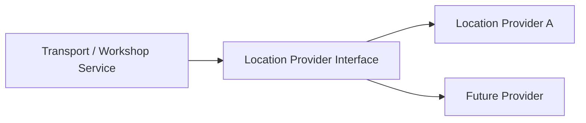

Dengan pola tersebut penggantian provider tidak membutuhkan perubahan pada seluruh business logic.

Hal ini penting karena perubahan harga atau kebijakan Maps API telah diidentifikasi sebagai risiko proyek.

# 21. Integrasi Payment Provider

Backend menyediakan adapter payment.

Business logic tidak menggunakan SDK payment langsung pada Billing Service.

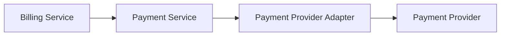

Payment Provider harus memberikan identifier transaksi yang disimpan pada `external_reference`.

Webhook harus melalui proses:

1. Verifikasi authenticity.
2. Verifikasi transaction reference.
3. Verifikasi nominal.
4. Verifikasi invoice.
5. Idempotency check.
6. Update payment.
7. Update invoice.
8. Update booking jika diperlukan.

# 22. Integrasi Notification

Notification Service digunakan sebagai satu pintu pengiriman notifikasi.

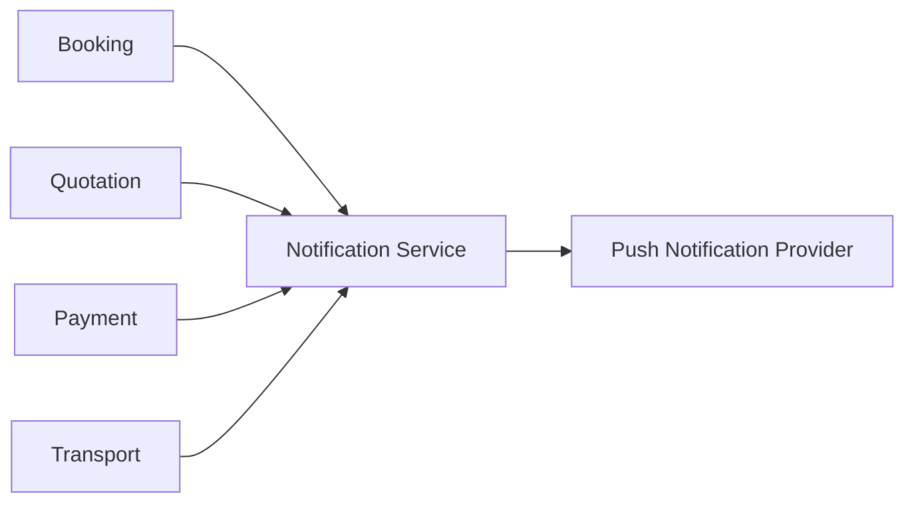

Contoh event:

1. Booking diterima.
2. Driver ditugaskan.
3. Kendaraan diterima bengkel.
4. Quote baru tersedia.
5. Quote disetujui.
6. Servis dimulai.
7. Servis selesai.
8. Invoice tersedia.
9. Payment berhasil.
10. Kendaraan sedang diantar.

# 23. Penggunaan Redis

Redis digunakan sebagai supporting infrastructure.

Penggunaan awal yang disarankan:

1. Rate limiting API.
2. Cache data workshop.
3. Cache service catalog.
4. Cache availability yang sering dibaca.
5. Temporary authentication state apabila mekanisme authentication membutuhkannya.
6. Distributed locking pada proses tertentu apabila kemudian diperlukan.

Data berikut tidak boleh hanya disimpan di Redis:

1. Booking.
2. Quote.
3. Approval.
4. Service status.
5. Invoice.
6. Payment.
7. Handover kendaraan.

# 24. Security Design

## 24.1 Authentication

Backend harus memverifikasi identitas pengguna sebelum memberikan akses terhadap resource private.

Teknologi authentication final belum ditentukan pada sumber project sehingga pemilihan session atau token masih menjadi keputusan implementasi.

## 24.2 Authorization

ServiceRide menggunakan Role Based Access Control.

Contoh:

| Resource | Customer | Admin | Mekanik | Driver |
|---|---:|---:|---:|---:|
| Kendaraan sendiri | Read/Write | No | Read terbatas | Read terbatas |
| Booking customer | Read/Write terbatas | Read/Write | Read terbatas | Read terbatas |
| Pemeriksaan | Read | Read | Write | No |
| Quote | Approve | Write | Draft/Input | No |
| Service Job | Read | Manage | Write | No |
| Transport Task | Read | Manage | No | Write |
| Payment | Create/Read | Read | No | No |

Authorization juga harus memeriksa ownership.

Customer dengan role yang benar tetap tidak boleh mengakses booking milik customer lain.

## 24.3 Sensitive Data

Password tidak disimpan dalam bentuk plaintext.

Data sensitif tidak boleh dicatat langsung pada application log.

Contoh data yang harus dihindari dari log:

1. Password.
2. Authentication secret.
3. Payment credential.
4. Full payment token.

# 25. Data Consistency

Operasi yang mengubah beberapa tabel sekaligus harus menggunakan database transaction.

Contoh pembuatan booking:

```text
BEGIN

insert bookings
insert booking_services
insert booking_status_history
reserve workshop slot

COMMIT
```

Apabila salah satu operasi gagal:

```text
ROLLBACK
```

Prinsip yang sama berlaku pada:

1. Quote dan quote items.
2. Approval dan perubahan status.
3. Invoice.
4. Payment webhook.
5. Handover dan perubahan status transport.

# 26. Audit Trail

ServiceRide membutuhkan auditability karena terdapat perubahan status kendaraan dan biaya.

Minimal aktivitas berikut harus dapat ditelusuri:

1. Siapa yang menerima booking.
2. Siapa yang mengubah status.
3. Mekanik yang melakukan pemeriksaan.
4. Mekanik yang melakukan servis.
5. Siapa yang membuat quote.
6. Quote mana yang disetujui.
7. Siapa yang memberikan approval.
8. Driver yang mengambil kendaraan.
9. Driver yang mengembalikan kendaraan.
10. Status payment.

`BOOKING_STATUS_HISTORY` tidak boleh diperbarui untuk mengganti histori lama.

Setiap perubahan dibuat sebagai record baru.

# 27. Deployment Architecture

Deployment provider belum ditetapkan sehingga diagram berikut merupakan logical deployment architecture.

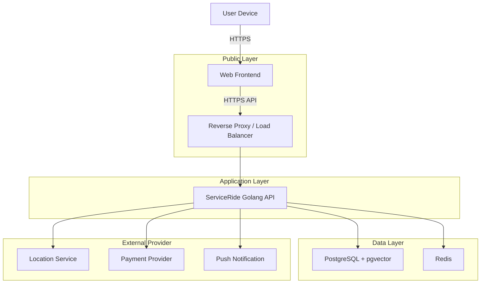

Database tidak diekspos langsung ke jaringan publik.

Akses database hanya diberikan kepada backend atau komponen administrasi yang secara eksplisit diizinkan.

# 28. Traceability SKPL dan DPPL

Traceability digunakan agar kebutuhan pada SKPL dapat ditelusuri sampai komponen implementasinya.

| SKPL | Implementasi DPPL Utama |
|---|---|
| SKPL-F-001 | Auth Module, User, Role, Authorization |
| SKPL-F-002 | Vehicle Module, VEHICLES |
| SKPL-F-003 | Workshop Module, Location Adapter |
| SKPL-F-004 | WORKSHOPS, SERVICES |
| SKPL-F-005 | Troubleshooting Module, pgvector |
| SKPL-F-006 | Troubleshooting, Services, Quote |
| SKPL-F-007 | Booking Module, BOOKINGS |
| SKPL-F-008 | WORKSHOP_SLOTS |
| SKPL-F-009 | Transport Module |
| SKPL-F-010 | WORKSHOP_MEMBERS, TRANSPORT_TASKS |
| SKPL-F-011 | INSPECTIONS, INSPECTION_ITEMS |
| SKPL-F-012 | QUOTES, QUOTE_ITEMS |
| SKPL-F-013 | QUOTE_APPROVALS |
| SKPL-F-014 | Booking Service, BOOKING_STATUS_HISTORY |
| SKPL-F-015 | Booking Detail dan Status History |
| SKPL-F-016 | Invoice, Payment Module |
| SKPL-F-017 | Notification Service |
| SKPL-F-018 | Workshop Module |
| SKPL-F-019 | Booking Management |
| SKPL-F-020 | Support Module |

# 29. Keputusan yang Belum Final

Beberapa bagian belum mempunyai keputusan resmi dari dokumen project sebelumnya sehingga tidak ditetapkan secara permanen pada DPPL versi awal ini.

1. Mekanisme authentication antara session atau token.

2. Payment Provider yang akan digunakan.

3. Push Notification Provider.

4. Location Service final untuk setiap platform.

5. Cloud Provider.

6. Strategi realtime update, apabila nantinya diperlukan.

7. Detail deployment fisik dan jumlah instance.

8. Struktur final database setelah migration pertama dibuat.

9. Bentuk model atau metode yang digunakan pada troubleshooting.

10. Dimensi vector pada pgvector.

Perubahan terhadap bagian tersebut tidak otomatis mengubah requirement pada SKPL selama fungsi bisnis yang diberikan kepada pengguna tetap sama.

# 30. Kesimpulan

DPPL ServiceRide mendefinisikan rancangan awal sistem mulai dari frontend, backend, database, relasi data, API, proses booking, pemeriksaan, persetujuan biaya, pickup dan delivery, pembayaran, sampai deployment.

Rancangan dibuat dengan memisahkan domain utama ServiceRide sehingga perubahan pada satu bagian tidak secara langsung memengaruhi seluruh sistem.

Database PostgreSQL menjadi sumber data utama, Redis berfungsi sebagai infrastructure pendukung, dan pgvector disiapkan untuk kebutuhan pencarian berbasis vector pada proses troubleshooting.

Struktur booking, quote, approval, invoice, payment, transport, dan audit trail dipisahkan karena masing masing memiliki lifecycle berbeda dan merupakan bagian krusial dalam menjaga konsistensi proses ServiceRide.

DPPL ini menjadi baseline awal implementasi. Perubahan arsitektur, tabel, API, maupun provider eksternal harus tetap menjaga kesesuaian terhadap requirement yang telah ditentukan pada SKPL ServiceRide.
