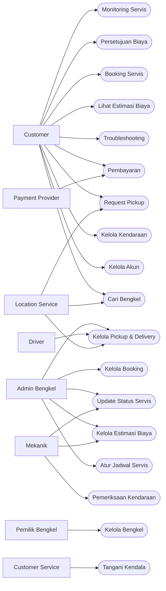

# SPESIFIKASI KEBUTUHAN PERANGKAT LUNAK

## ServiceRide

| Informasi     | Keterangan                            |
| ------------- | ------------------------------------- |
| Nama Sistem   | ServiceRide                           |
| Jenis Dokumen | Spesifikasi Kebutuhan Perangkat Lunak |
| Singkatan     | SKPL                                  |
| Versi         | 1.0                                   |
| Status        | Draft                                 |

# 1. Pendahuluan

ServiceRide merupakan aplikasi yang dirancang untuk menghubungkan pelanggan atau pemilik kendaraan dengan penyedia jasa servis kendaraan atau bengkel secara digital.

ServiceRide dikembangkan untuk membantu pelanggan yang kurang memahami kondisi maupun kebutuhan perawatan kendaraannya. Sistem menyediakan fasilitas troubleshooting awal, estimasi biaya, booking servis, penjadwalan, pickup dan delivery kendaraan, monitoring proses servis, pembayaran, serta komunikasi antara pelanggan dengan pihak bengkel.

Sistem dirancang agar dapat digunakan melalui aplikasi web maupun mobile oleh pelanggan serta pihak yang terlibat dalam operasional bengkel.

# 2. Tujuan

Tujuan pengembangan ServiceRide adalah:

1. Mempermudah pelanggan dalam melakukan reservasi servis kendaraan.
2. Membantu pelanggan mengetahui kebutuhan awal servis melalui proses troubleshooting.
3. Memberikan estimasi awal biaya servis.
4. Mempermudah pelanggan dalam menentukan bengkel dan jadwal servis.
5. Menyediakan layanan pickup dan delivery kendaraan.
6. Memberikan informasi perkembangan proses servis kendaraan.
7. Membantu bengkel dalam mengelola booking dan aktivitas pelayanan.
8. Menyediakan mekanisme persetujuan apabila terdapat perubahan pekerjaan atau biaya.
9. Mendukung proses pembayaran secara digital.
10. Meningkatkan transparansi proses servis antara pelanggan dan bengkel.

# 3. Ruang Lingkup

ServiceRide mencakup proses pelayanan kendaraan sejak pelanggan mencari layanan hingga kendaraan selesai diservis.

Ruang lingkup sistem meliputi:

1. Pengelolaan akun pengguna.
2. Pengelolaan kendaraan pelanggan.
3. Pencarian dan pemilihan bengkel.
4. Pemilihan layanan servis.
5. Troubleshooting awal kendaraan.
6. Estimasi biaya servis.
7. Booking dan penjadwalan servis.
8. Pickup dan delivery kendaraan.
9. Pemeriksaan kendaraan.
10. Persetujuan perubahan biaya.
11. Monitoring proses servis.
12. Pembayaran.
13. Notifikasi.
14. Pengelolaan operasional bengkel.

# 4. Deskripsi Umum Sistem

ServiceRide memiliki dua sisi utama, yaitu pelanggan dan penyedia layanan bengkel.

Pelanggan menggunakan ServiceRide untuk mencari bengkel, menentukan layanan, melakukan booking, memilih jadwal, meminta pickup kendaraan, melihat estimasi biaya, memantau perkembangan servis, menyetujui perubahan biaya, dan melakukan pembayaran.

Pihak bengkel menggunakan sistem untuk menerima booking, mengatur jadwal, mengelola mekanik dan driver, melakukan pemeriksaan kendaraan, memperbarui status servis, serta menentukan rincian biaya.

Secara umum proses pelayanan ServiceRide berlangsung melalui tahapan berikut:

1. Pelanggan memilih kendaraan, bengkel, layanan, dan jadwal.
2. Sistem membuat booking servis.
3. Bengkel menerima booking.
4. Kendaraan diantar pelanggan atau dijemput driver.
5. Mekanik melakukan pemeriksaan kendaraan.
6. Bengkel memberikan hasil pemeriksaan dan rincian biaya.
7. Pelanggan memberikan persetujuan apabila terdapat pekerjaan tambahan.
8. Mekanik melakukan proses servis.
9. Pelanggan memantau perkembangan servis.
10. Pelanggan melakukan pembayaran.
11. Kendaraan diambil atau diantarkan kembali.
12. Booking dinyatakan selesai.

# 5. Stakeholder dan Aktor

Stakeholder ServiceRide melibatkan pihak pelanggan, operasional bengkel, pengelola proyek, serta layanan eksternal.

| Stakeholder / Aktor | Peran                                                                                               |
| ------------------- | --------------------------------------------------------------------------------------------------- |
| Customer            | Melakukan booking, mengelola kendaraan, memilih layanan, memantau servis, dan melakukan pembayaran. |
| Admin Bengkel       | Mengelola booking, jadwal, mekanik, driver, dan operasional pelayanan.                              |
| Mekanik             | Melakukan pemeriksaan serta pengerjaan servis kendaraan.                                            |
| Driver              | Melakukan pickup dan delivery kendaraan.                                                            |
| Pemilik Bengkel     | Mengelola informasi, layanan, harga, serta operasional bengkel.                                     |
| Customer Service    | Membantu menangani permasalahan pelanggan.                                                          |
| Project Manager     | Mengelola ruang lingkup, jadwal, risiko, dan pelaksanaan proyek.                                    |
| Business Analyst    | Menganalisis kebutuhan bisnis dan sistem.                                                           |
| Tim Pengembang      | Mengembangkan dan memelihara sistem ServiceRide.                                                    |
| Payment Provider    | Menyediakan layanan transaksi pembayaran digital.                                                   |
| Location Service    | Menyediakan fungsi lokasi dan perhitungan jarak.                                                    |
| Cloud Provider      | Menyediakan infrastruktur untuk menjalankan sistem.                                                 |

# 6. Kebutuhan Fungsional

| ID         | Kebutuhan             | Deskripsi                                                                                  |
| ---------- | --------------------- | ------------------------------------------------------------------------------------------ |
| SKPL-F-001 | Autentikasi Pengguna  | Sistem harus menyediakan autentikasi dan membatasi akses berdasarkan peran pengguna.       |
| SKPL-F-002 | Pengelolaan Kendaraan | Customer dapat menambah, melihat, mengubah, dan mengelola data kendaraan.                  |
| SKPL-F-003 | Pencarian Bengkel     | Customer dapat mencari bengkel yang tersedia.                                              |
| SKPL-F-004 | Informasi Bengkel     | Sistem menampilkan lokasi, jam operasional, layanan, dan informasi bengkel.                |
| SKPL-F-005 | Troubleshooting       | Customer dapat memasukkan keluhan kendaraan untuk mendapatkan informasi awal.              |
| SKPL-F-006 | Estimasi Biaya        | Sistem memberikan estimasi awal biaya berdasarkan layanan atau hasil troubleshooting.      |
| SKPL-F-007 | Booking Servis        | Customer dapat membuat booking servis berdasarkan kendaraan, bengkel, layanan, dan jadwal. |
| SKPL-F-008 | Jadwal Servis         | Sistem mengelola jadwal berdasarkan ketersediaan bengkel.                                  |
| SKPL-F-009 | Pickup Kendaraan      | Customer dapat memilih layanan pickup apabila tersedia.                                    |
| SKPL-F-010 | Pengelolaan Driver    | Admin Bengkel dapat menentukan driver untuk pickup atau delivery.                          |
| SKPL-F-011 | Pemeriksaan Kendaraan | Mekanik dapat mencatat hasil pemeriksaan kendaraan.                                        |
| SKPL-F-012 | Perubahan Biaya       | Bengkel dapat memberikan rincian biaya baru apabila ditemukan pekerjaan tambahan.          |
| SKPL-F-013 | Persetujuan Biaya     | Customer dapat menerima atau menolak pekerjaan tambahan.                                   |
| SKPL-F-014 | Status Servis         | Bengkel atau mekanik dapat memperbarui status servis kendaraan.                            |
| SKPL-F-015 | Monitoring Servis     | Customer dapat melihat perkembangan servis kendaraan.                                      |
| SKPL-F-016 | Pembayaran            | Customer dapat melakukan pembayaran melalui metode pembayaran yang tersedia.               |
| SKPL-F-017 | Notifikasi            | Sistem memberikan notifikasi terhadap perubahan penting pada booking atau servis.          |
| SKPL-F-018 | Pengelolaan Bengkel   | Pemilik atau Admin Bengkel dapat mengelola informasi dan layanan bengkel.                  |
| SKPL-F-019 | Pengelolaan Booking   | Admin Bengkel dapat melihat, menerima, dan mengelola booking.                              |
| SKPL-F-020 | Customer Service      | Customer Service dapat membantu menangani permasalahan pelanggan.                          |

# 7. Kebutuhan Nonfungsional

| ID          | Kebutuhan        | Deskripsi                                                                               |
| ----------- | ---------------- | --------------------------------------------------------------------------------------- |
| SKPL-NF-001 | Security         | Sistem harus melindungi data pengguna, kendaraan, transaksi, dan data operasional.      |
| SKPL-NF-002 | Authorization    | Pengguna hanya dapat mengakses fungsi sesuai dengan perannya.                           |
| SKPL-NF-003 | Data Consistency | Data booking, pembayaran, pickup, dan status servis harus tersimpan secara konsisten.   |
| SKPL-NF-004 | Availability     | Sistem harus tersedia selama layanan ServiceRide beroperasi.                            |
| SKPL-NF-005 | Reliability      | Sistem harus menjaga proses booking dan perubahan status dari perubahan yang tidak sah. |
| SKPL-NF-006 | Usability        | Antarmuka harus dapat dipahami oleh pelanggan maupun pengguna bengkel.                  |
| SKPL-NF-007 | Maintainability  | Sistem harus memiliki struktur yang mendukung pemeliharaan dan pengembangan lanjutan.   |
| SKPL-NF-008 | Compatibility    | Sistem harus mendukung platform web dan mobile sesuai implementasi yang dikembangkan.   |
| SKPL-NF-009 | Integration      | Sistem harus mendukung integrasi dengan layanan pihak ketiga.                           |
| SKPL-NF-010 | Auditability     | Aktivitas penting dalam proses pelayanan harus memiliki riwayat yang dapat ditelusuri.  |

# 8. Use Case Diagram

# 9. Spesifikasi Use Case

Pada bagian ini tabel dipakai karena setiap use case memiliki atribut yang sama sehingga lebih ringkas dibandingkan membuat subbab terpisah.

| ID     | Use Case              | Aktor                      | Prasyarat                           | Alur Utama                                                                                        | Hasil                              |
| ------ | --------------------- | -------------------------- | ----------------------------------- | ------------------------------------------------------------------------------------------------- | ---------------------------------- |
| UC-001 | Booking Servis        | Customer                   | Login dan memiliki data kendaraan   | Memilih kendaraan → bengkel → layanan → jadwal → konfirmasi booking                               | Booking tersimpan                  |
| UC-002 | Troubleshooting       | Customer                   | Memilih kendaraan                   | Memasukkan keluhan → sistem memproses → hasil dan rekomendasi ditampilkan                         | Informasi awal kendaraan diperoleh |
| UC-003 | Pickup Kendaraan      | Customer, Driver           | Booking diterima dan pickup dipilih | Admin menentukan driver → driver mengambil kendaraan → serah terima → kendaraan dibawa ke bengkel | Kendaraan diterima bengkel         |
| UC-004 | Pemeriksaan Kendaraan | Mekanik                    | Kendaraan telah diterima            | Mekanik memeriksa → mencatat hasil → menentukan pekerjaan dan biaya                               | Hasil pemeriksaan tersimpan        |
| UC-005 | Persetujuan Biaya     | Customer                   | Terdapat perubahan biaya            | Sistem mengirim rincian → customer menerima atau menolak                                          | Keputusan customer tersimpan       |
| UC-006 | Monitoring Servis     | Customer                   | Terdapat booking aktif              | Customer membuka booking → sistem menampilkan status terbaru                                      | Status kendaraan diketahui         |
| UC-007 | Pembayaran            | Customer, Payment Provider | Tagihan tersedia                    | Customer memilih pembayaran → transaksi diproses → hasil transaksi diterima                       | Status pembayaran diperbarui       |
| UC-008 | Kelola Booking        | Admin Bengkel              | Admin telah login                   | Admin melihat booking → menerima atau mengelola booking                                           | Booking diproses bengkel           |
| UC-009 | Update Status Servis  | Mekanik, Admin Bengkel     | Servis sedang berlangsung           | Status pekerjaan diperbarui sesuai proses aktual                                                  | Riwayat status tersimpan           |
| UC-010 | Delivery Kendaraan    | Driver                     | Servis selesai dan delivery dipilih | Driver menerima tugas → mengambil kendaraan → mengantar ke customer → serah terima                | Kendaraan diterima customer        |

# 10. Aturan Bisnis

| ID     | Aturan Bisnis                                                                      |
| ------ | ---------------------------------------------------------------------------------- |
| BR-001 | Estimasi biaya sebelum pemeriksaan bukan merupakan biaya akhir.                    |
| BR-002 | Kerusakan tambahan harus disertai rincian perubahan biaya.                         |
| BR-003 | Pekerjaan tambahan yang meningkatkan biaya harus mendapatkan persetujuan customer. |
| BR-004 | Pickup dan delivery harus memiliki catatan serah terima kendaraan.                 |
| BR-005 | Driver yang menangani kendaraan harus tercatat pada sistem.                        |
| BR-006 | Status kendaraan harus mencerminkan kondisi pelayanan yang sebenarnya.             |
| BR-007 | Booking harus menyesuaikan jadwal dan kapasitas bengkel.                           |
| BR-008 | Customer hanya dapat melakukan transaksi terhadap booking miliknya.                |
| BR-009 | Mekanik hanya dapat mengelola pekerjaan servis yang menjadi tanggung jawabnya.     |
| BR-010 | Driver hanya dapat mengelola tugas pickup atau delivery yang diberikan kepadanya.  |

# 11. Kebutuhan Data

| Data              | Informasi Utama                                                |
| ----------------- | -------------------------------------------------------------- |
| Pengguna          | Identitas, kontak, autentikasi, role, status akun              |
| Kendaraan         | Pemilik, jenis kendaraan, dan informasi kendaraan              |
| Bengkel           | Nama, lokasi, jam operasional, layanan, harga, kapasitas       |
| Booking           | Customer, kendaraan, bengkel, layanan, keluhan, jadwal, status |
| Pickup / Delivery | Driver, lokasi, waktu, status perjalanan, serah terima         |
| Servis            | Mekanik, pemeriksaan, pekerjaan, komponen, biaya, status       |
| Persetujuan       | Customer, perubahan pekerjaan atau biaya, keputusan            |
| Pembayaran        | Booking, total, metode, status, referensi transaksi            |
| Riwayat Status    | Status, waktu perubahan, pihak yang melakukan perubahan        |
| Notifikasi        | Penerima, jenis informasi, waktu, status pengiriman            |

# 12. Batasan Sistem

ServiceRide memiliki batasan sebagai berikut:

1. Hasil troubleshooting merupakan informasi awal dan tidak menggantikan pemeriksaan langsung oleh mekanik.
2. Estimasi biaya awal tidak selalu sama dengan biaya akhir.
3. Ketersediaan jadwal bergantung pada kapasitas bengkel.
4. Layanan pickup dan delivery bergantung pada ketersediaan driver.
5. Informasi lokasi bergantung pada layanan lokasi yang digunakan.
6. Pembayaran digital bergantung pada layanan Payment Provider.
7. Pengiriman notifikasi bergantung pada layanan notifikasi yang digunakan.
8. Gangguan layanan pihak ketiga dapat memengaruhi fungsi tertentu pada ServiceRide.
9. Ketepatan status servis bergantung pada pembaruan informasi dari pihak bengkel.
10. ServiceRide tidak menentukan diagnosis akhir kendaraan tanpa pemeriksaan mekanik.

Ketergantungan terhadap layanan seperti Maps API, payment gateway, push notification, serta layanan lokasi juga merupakan salah satu risiko teknologi yang telah diidentifikasi dalam perencanaan proyek.

# 13. Asumsi dan Ketergantungan

## 13.1 Asumsi

1. Customer memiliki perangkat dan koneksi internet untuk menggunakan ServiceRide.
2. Bengkel memiliki petugas yang bertanggung jawab mengelola booking.
3. Bengkel memperbarui status kendaraan sesuai proses pelayanan.
4. Mekanik memberikan hasil pemeriksaan berdasarkan kondisi kendaraan.
5. Driver memiliki perangkat untuk menerima informasi tugas.
6. Informasi layanan, harga, dan jam operasional diperbarui oleh pihak bengkel.

## 13.2 Ketergantungan

ServiceRide memiliki ketergantungan terhadap beberapa layanan eksternal, yaitu:

1. Location Service untuk pencarian lokasi, bengkel, jarak, pickup, dan delivery.
2. Payment Provider untuk transaksi pembayaran digital.
3. Push Notification Service untuk mengirimkan informasi perubahan status.
4. Cloud Infrastructure untuk menjalankan aplikasi dan layanan pendukung.

Gangguan atau perubahan kebijakan pada layanan eksternal tersebut dapat memengaruhi sebagian fungsi ServiceRide.

# Penutup

Dokumen SKPL ServiceRide digunakan sebagai acuan dalam proses perancangan, implementasi, dan pengujian perangkat lunak.

Kebutuhan yang tercantum dalam dokumen ini selanjutnya menjadi dasar penyusunan DPPL serta test case pada tahap pengujian sehingga setiap implementasi dapat ditelusuri kembali kepada kebutuhan sistem yang telah ditentukan.
